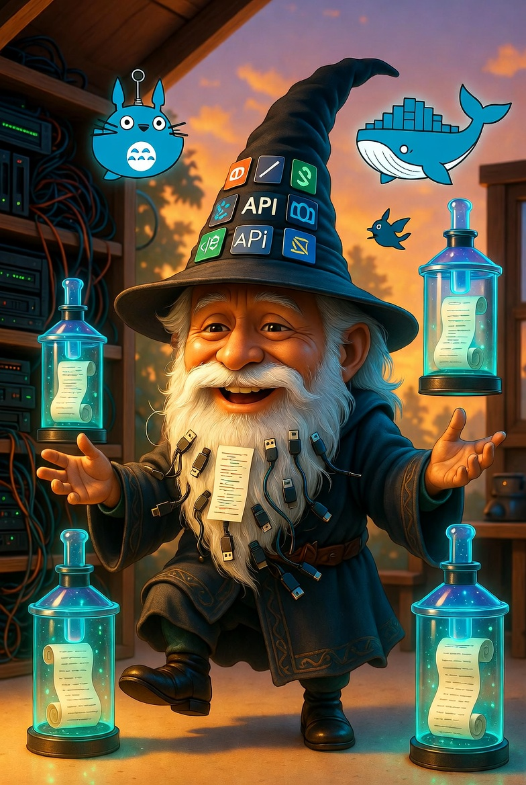
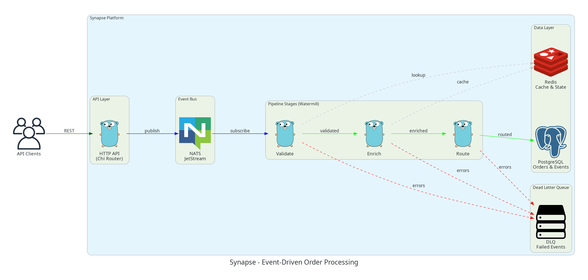
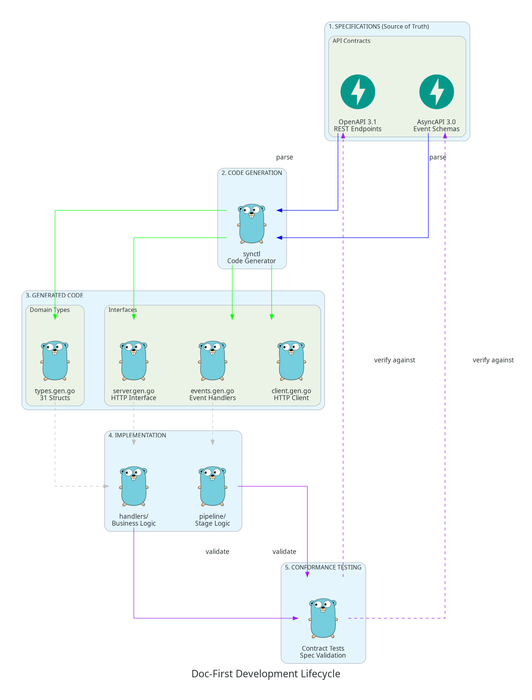
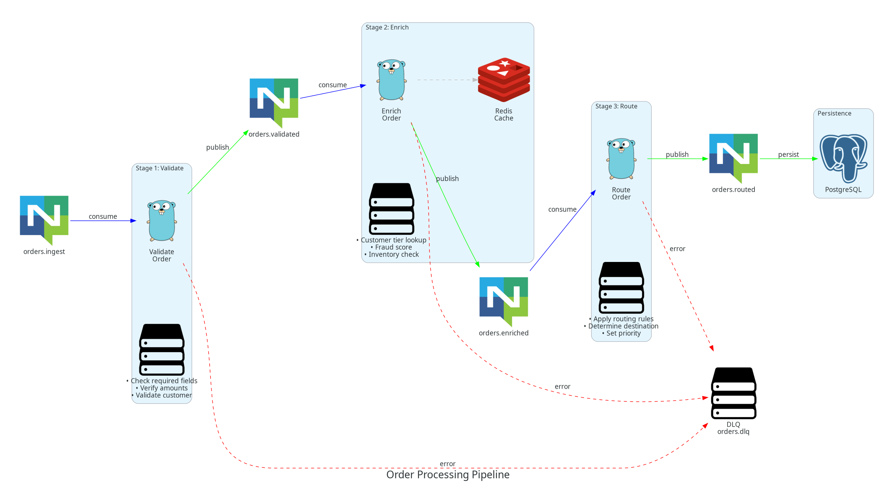
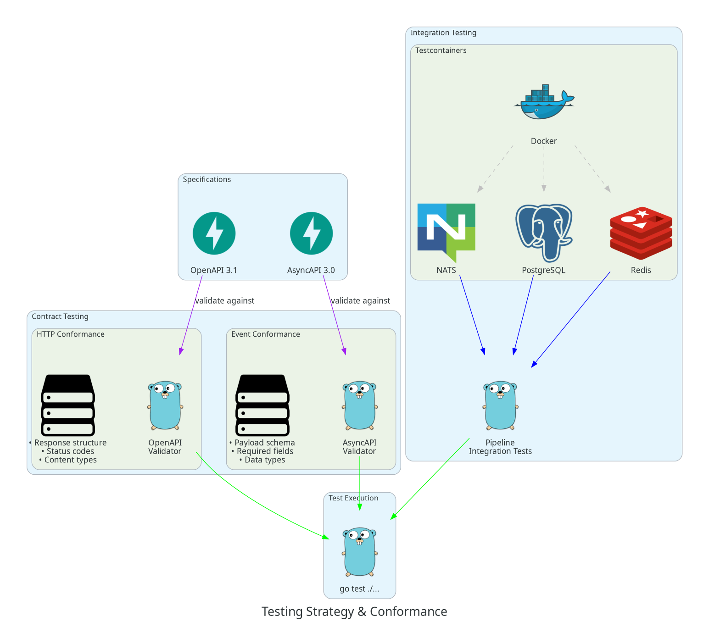

<p align="center">
  
</p>

# Synapse: Doc-First Event Processing

> *"We're software engineers. We create worlds. Why wouldn't we try to make them perfect?"*

A complete demonstration of **specification-driven development** using Go, showcasing how to build event-driven systems where the spec is the single source of truth.



## What Is This?

This project demonstrates a **doc-first development workflow**:

1. **Write specifications first** (OpenAPI 3.1 + AsyncAPI 3.0)
2. **Generate code from specs** (custom `synctl` generator)
3. **Implement to interfaces** (handlers, pipeline stages)
4. **Validate with conformance tests** (responses must match specs)

## Quick Start

```bash
# Clone the repo
git clone https://github.com/copyleftdev/synapse-spec-first.git
cd synapse-spec-first

# Download dependencies
go mod tidy

# Generate code from specs
go run ./cmd/synctl

# Run all tests
go test ./... -v

# Run the server
go run ./cmd/synapse
```

## The Philosophy



Traditional development: *Write code → Document later (maybe)*

Doc-first development: *Write spec → Generate code → Implement → Prove conformance*

Read the full article: **[ARTICLE.md](ARTICLE.md)**

## Architecture

### System Overview



- **API Layer**: Chi router with generated interfaces
- **Event Bus**: NATS JetStream via Watermill
- **Pipeline**: Validate → Enrich → Route stages
- **Storage**: PostgreSQL for persistence, Redis for caching
- **Testing**: Testcontainers for real infrastructure

### Project Structure

```
synapse/
├── asyncapi/              # AsyncAPI 3.0 event specifications
├── openapi/               # OpenAPI 3.1 REST specifications
├── cmd/
│   ├── synapse/           # Application entry point
│   └── synctl/            # Custom code generator
├── internal/
│   ├── generated/         # Generated from specs
│   ├── handler/           # HTTP handlers
│   ├── pipeline/          # Watermill event pipeline
│   ├── conformance/       # Contract testing
│   └── testutil/          # Testcontainers helpers
└── scripts/               # Diagram generation
```

## Testing Strategy



### Conformance Testing

```go
// Validate HTTP responses against OpenAPI schema
result := suite.RunTest(ctx, client, baseURL,
    "GET", "/health",
    nil,
    http.StatusOK,
    "HealthResponse",  // Must match this schema
)

// Validate events against AsyncAPI schema
result := suite.ValidateEvent(
    "orders/ingest",
    "OrderReceivedPayload",
    orderJSON,
)
```

### Running Tests

```bash
# Unit tests (fast)
go test ./... -short

# Integration tests (requires Docker)
go test ./... -v

# Conformance tests only
go test ./internal/conformance/... -v
```

## Code Generation

The custom `synctl` generator creates:

| File | Contents |
|------|----------|
| `types.gen.go` | 31 Go structs from OpenAPI + AsyncAPI schemas |
| `server.gen.go` | HTTP interface with all endpoint methods |
| `client.gen.go` | Typed HTTP client with auth |
| `events.gen.go` | Watermill publishers + handlers |

```bash
# Regenerate after spec changes
go run ./cmd/synctl
```

## Diagrams

Generated using Python's [diagrams](https://diagrams.mingrammer.com/) library:

```bash
cd scripts
./venv/bin/python generate_all.py
```

| Diagram | Description |
|---------|-------------|
| [architecture.png](scripts/output/architecture.png) | System architecture |
| [doc_first_lifecycle.png](scripts/output/doc_first_lifecycle.png) | Development workflow |
| [pipeline_stages.png](scripts/output/pipeline_stages.png) | Event processing |
| [testing_strategy.png](scripts/output/testing_strategy.png) | Testing approach |
| [philosophy.png](scripts/output/philosophy.png) | Core principles |

## Technology Stack

- **Go 1.21+** — Application language
- **Chi** — HTTP router
- **Watermill** — Event-driven processing
- **NATS** — Message broker
- **PostgreSQL** — Persistence
- **Redis** — Caching
- **Testcontainers** — Integration testing
- **OpenAPI 3.1** — REST API specification
- **AsyncAPI 3.0** — Event specification

## Acknowledgments

- **OpenAPI Initiative** — REST API specification standard
- **AsyncAPI Initiative** — Event-driven API specification
- **Testcontainers** — Real infrastructure in tests
- **Three Dots Labs** — Watermill event library
- **NATS.io** — High-performance messaging

## License

MIT

---

*Built to demonstrate that "the perfect world" is the one we choose to create.*
